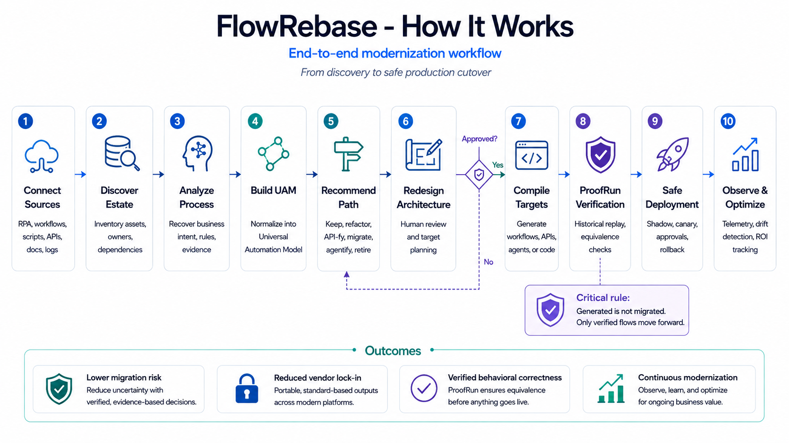
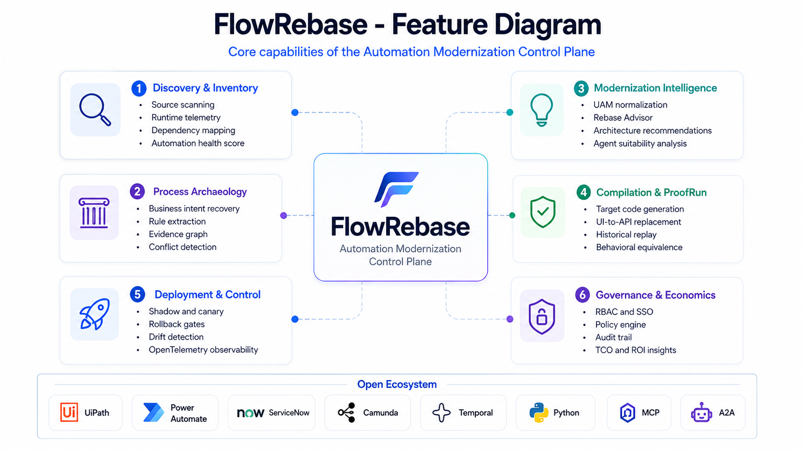
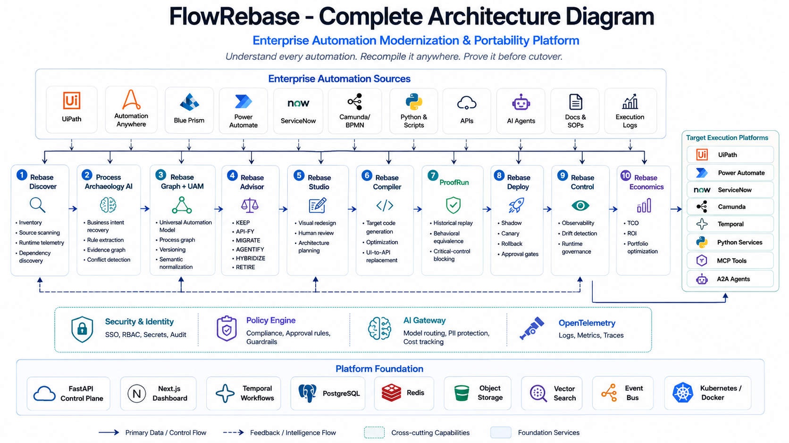

# FlowRebase

**Understand every automation. Recompile it anywhere. Prove it before cutover.**

FlowRebase is an open-core, vendor-neutral **Automation Modernization Control Plane**. It discovers automation assets, reconstructs process intent, normalizes them into the Universal Automation Model (UAM), recommends the right modernization strategy, compiles portable target artifacts, verifies behavior with ProofRun, and supports safe rollout and continuous control.



## What is included



- FastAPI control plane with RBAC-ready authentication, REST APIs, persistence, audit-friendly entities and OpenAPI docs.
- Universal Automation Model (UAM) with versionable process semantics, evidence, policies and runtime metadata.
- Source adapters for UiPath XAML, BPMN 2.0 XML and Python source.
- Modernization Advisor with deterministic scoring and optional LLM augmentation.
- Target compilers for Python, BPMN and a Power Automate draft definition.
- ProofRun behavioral replay engine with critical-control blocking.
- Digital Twin simulation for failure, latency and cost what-if analysis.
- Policy engine with local policy evaluation and optional OPA integration.
- Next.js enterprise dashboard.
- Temporal workflow definitions for durable analysis/compile/proof workflows.
- PostgreSQL, Redis, OpenTelemetry-ready configuration and Docker Compose.
- UAM TypeScript package, Python SDK, examples, tests and CI.

## Architecture



```text
Sources                         FlowRebase                              Targets

UiPath ─────┐               ┌───────────────────┐                  ┌─ Power Automate
BPMN ───────┼─> Parsers ───>│ Universal        │──> Advisor ─────┼─ Python
Python ─────┤               │ Automation Model │                  ├─ BPMN/Camunda
Other RPA ──┘               └─────────┬─────────┘                  └─ Agent adapters
                                     │
                          ┌──────────┼───────────┐
                          ▼          ▼           ▼
                       ProofRun   Digital Twin  Control
```

## Quick start

### Option A. Docker

```bash
cp .env.example .env
docker compose up --build
```

Open:

- Web: http://localhost:3000
- API: http://localhost:8000
- OpenAPI: http://localhost:8000/docs

### Option B. Local backend

```bash
cd backend
python -m venv .venv
source .venv/bin/activate
pip install -e '.[dev]'
cp ../.env.example ../.env
uvicorn app.main:app --reload --port 8000
```

### Local frontend

```bash
cd frontend
npm install
npm run dev
```

## Demo flow

```bash
curl -X POST http://localhost:8000/api/v1/demo/seed
curl http://localhost:8000/api/v1/portfolio/summary
```

Import a UiPath XAML process:

```bash
curl -X POST http://localhost:8000/api/v1/automations/import \
  -H 'Content-Type: application/json' \
  -d @examples/import-uipath.json
```

Then use the returned automation/process ID to run recommendation, compilation and ProofRun.

## Production notes

The repository is designed as a production-grade reference implementation and a strong base for an enterprise product. Target-platform deployment adapters still require customer-specific credentials, environment metadata and vendor APIs. Generated artifacts are treated as **candidates**, never as automatically production-approved output. ProofRun and configured approval policies gate deployment.

For production use:

1. Use PostgreSQL, not the SQLite developer fallback.
2. Set `AUTH_MODE=oidc` and configure your OIDC issuer/audience.
3. Store secrets in Vault/Key Vault/Secrets Manager and inject references only.
4. Enable TLS at the ingress/load balancer.
5. Configure OPA for centralized policy decisions if required.
6. Enable a Temporal cluster for long-running migration workloads.
7. Run compiler or uploaded-script execution only in hardened sandbox workers.
8. Pin the latest patched framework versions before deployment. Next.js publishes regular security releases, so do not ship stale lockfiles.

## Repository layout

```text
backend/                  FastAPI control plane and modernization engine
frontend/                 Next.js dashboard
packages/uam-ts/          TypeScript UAM types
packages/sdk-python/      Python client SDK
examples/                 Demo automation, UAM, policy and replay cases
infra/                    Observability and deployment configuration
.github/workflows/        CI
```

## License

Apache-2.0 for this repository. Enterprise connectors, managed control-plane features and proprietary migration intelligence may be distributed separately under an open-core commercial model.
